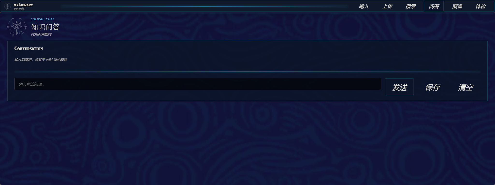
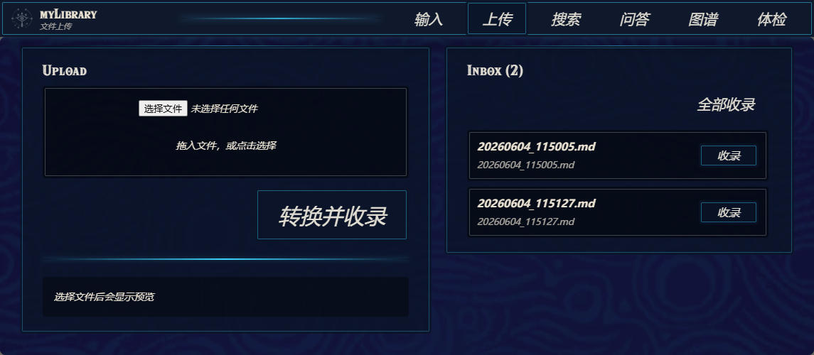

# 知识库助手 2.0：Zelda 风格 UI 更新

[English](README.en.md) | 简体中文

一只停在 Windows 桌面的三角龙，现在有了完整的知识库控制台。

1.0 版本的重点是“桌面宠物 + 透明玻璃小面板”：悬浮、拖拽、输入、上传、搜索都可以从桌面完成。2.0 保留这只宠物入口，但把主要工作区升级为 Zelda / Sheikah 风格的 React / WebView 面板：深蓝古代科技纹样、青色发光描边、Hylia 风格标题字、固定顶部导航、统一卡片布局、流式问答、知识图谱和 wiki 体检都放进同一套更稳定的界面里。

## 2.0 UI 升级重点

| 1.0 | 2.0 |
| --- | --- |
| Tkinter 透明玻璃面板，适合轻量操作 | React + Vite 前端，打包后通过 WebView 打开 |
| 每个功能像独立小窗 | 输入、上传、搜索、问答、图谱、体检共享统一标题栏和导航 |
| 搜索与预览以本地控件为主 | Zelda 风格深蓝纹样背景、青色边框、发光分割线和卡片化结果 |
| wiki 能力隐藏在后台 | 收录、问答、图谱、体检被整理成清晰工作流 |
| 偏“桌面小工具” | 更像一个围绕本地资料的个人知识库工作台 |

新版本不是简单换皮。它把“记录资料 -> 整理 wiki -> 搜索核对 -> 问答复用 -> 图谱巡检”串成一条更清楚的路径。

## 实际界面预览

下面是当前版本真实界面截图，不是概念图。

<p>
  
  
</p>

界面核心来自 `zelda-hyrule-ui`：顶部导航、Sheikah 符号、深蓝 rune 背景、青色发光边框、Hylia Serif 标题感和低饱和米色文字共同组成新版本的视觉语言。2.0 的目标不是做一个通用科技后台，而是把“桌面宠物知识库”变成一块更有游戏道具感的知识石板。

## UI 风格库来源

2.0 面板使用的 Zelda / Sheikah 风格组件来自 `zelda-hyrule-ui`：

- 项目仓库：[github.com/chaos-xxl/zelda-hyrule-ui](https://github.com/chaos-xxl/zelda-hyrule-ui)
- npm 包：[zelda-hyrule-ui](https://www.npmjs.com/package/zelda-hyrule-ui)
- 在线文档：[chaos-xxl.github.io/zelda-hyrule-ui](https://chaos-xxl.github.io/zelda-hyrule-ui/)
- 当前依赖版本：`zelda-hyrule-ui@^0.4.0`，见 `frontend/package.json`。
- 许可证：MIT，见包内 `frontend/node_modules/zelda-hyrule-ui/LICENSE`。

该组件库 README 声明它是受 *The Legend of Zelda: Breath of the Wild* 启发的非官方粉丝项目，不隶属于 Nintendo，也未获得 Nintendo 背书。本项目只引用该 React UI 组件库构建界面，不使用 Nintendo 官方游戏素材。

## 界面入口

桌面上仍然是一只可拖拽、会睡觉、会反馈上传状态的三角龙。

<p>
  
  
  
  
  
</p>

悬停宠物会显示六个入口：

- 输入：快速写入一条 Markdown 笔记。
- 上传：导入 Markdown、DOCX、PDF 和图片；Inbox 支持预览、收录和删除未收录文件。
- 搜索：全文搜索 `notes/`，支持标签、收藏、最近打开和阅读器预览。
- 问答：基于自动生成的 wiki 检索上下文，并流式回答。
- 图谱：查看 sources、entities、concepts 之间的关联。
- 体检：检查 wiki 断链、孤立页、索引漂移和重复项。

## 新面板体验

2.0 的面板使用 `frontend/` 下的 React 应用，生产包由 `frontend/dist` 提供，运行时由本地 FastAPI 服务和 WebView 承载。

主要变化：

- 固定顶部导航：不用再在多个小窗之间找入口。
- Zelda / Sheikah 风格深色控制台：统一背景、按钮、卡片、滚动条和状态反馈。
- 古代科技视觉元素：眼符号、rune 纹样、青色描边、发光分割线、Hylia 风格标题字。
- 结果卡片更紧凑：长路径和摘要会自动换行，不挤出面板。
- 搜索预览更完整：标签、收藏、最近打开和 wiki/raw note 预览统一在同一界面。
- 上传 Inbox 更可控：文件可以先暂存、预览、单个收录、全部收录，也可以直接删除对应 `notes/` 文件。
- 图谱和体检成为一等页面：不再只是后台维护工具。

## 数据流

```text
桌面宠物
  -> 输入 / 上传
  -> notes/ 原始资料
  -> wiki/ 自动编译层
  -> 搜索 / 问答 / 图谱 / 体检
```

三层数据保持分工：

- `notes/`：原始资料，用户可直接备份和迁移。
- `notes/.note_meta.json`：标签、收藏、最近打开等本地整理信息。
- `wiki/`：LLM 维护的编译层，包含 source summaries、entity pages、concept pages、`index.md` 和 `log.md`。

没有配置 LLM 时，输入、上传、搜索、阅读器、标签和本地文件管理仍可正常使用；wiki 收录、问答和 LLM 体检会自动跳过或降级。

## 支持的资料

- Markdown：直接进入 `notes/`，可搜索、预览、收录进 wiki。
- DOCX：保留原文件，wiki 收录时转换为 Markdown。
- PDF：支持文本页提取；扫描页可在 OCR 版本中识别。
- 图片：OCR 版本可把图片文字转为 Markdown。
- 拖放上传：拖到宠物或在上传页选择文件都走同一套保存流程。

## 安装运行

项目面向 Windows 桌面运行，推荐 Python 3.10+。

```bash
python -m venv .venv
.venv\Scripts\activate
pip install -r requirements.txt
```

启动源码版：

```bash
python app.py
```

开发 React 面板：

```bash
cd frontend
npm install
npm run build
```

源码运行时，React 面板默认读取 `frontend/dist`。打包版会自动启用 WebView 面板；源码版如需强制启用，可设置：

```bash
set MYLIBRARY_REACT_PANELS=1
python app.py
```

## LLM 配置

复制模板并填写本地密钥：

```bash
copy .env.template .env
```

示例：

```env
LLM_API_BASE=https://api.deepseek.com/v1
LLM_API_KEY=sk-...
LLM_MODEL=deepseek-chat
```

任何 OpenAI-compatible endpoint 都可以使用，例如 DeepSeek、SenseNova、Ollama、Groq、LM Studio。没有 `.env` 或没有填写 `LLM_API_KEY` 时，本地记录、上传和搜索仍可使用，wiki 收录、问答等 LLM 功能会自动跳过。

打包版 zip 当前不内置 `.env` 文件。需要 LLM 功能时，请在解压后的 exe 同级目录手动新建 `.env`，再写入上面的 `LLM_API_BASE`、`LLM_API_KEY`、`LLM_MODEL`。

## OCR 版本

基础安装不包含 PaddleOCR。需要图片、扫描 PDF、文档内图片识别时安装：

```bash
pip install paddleocr paddlepaddle
```

发布包通常分为两个版本：

| 包 | OCR | 适合 |
| --- | --- | --- |
| Lite | 不包含 | 记录、上传、搜索、wiki、问答、图谱和体检 |
| OCR | 包含 PaddleOCR、PaddlePaddle 和中文 OCR 模型 | 图片、扫描 PDF、文档截图识别 |

两个打包版都不会自动生成 `.env`；LLM 配置文件需要用户手动放在 exe 同级目录。

## 常用命令

```bash
# 全部测试
python -m pytest tests/

# 单个测试文件 / 测试
python -m pytest tests/test_web_panel_api.py -q
python -m pytest tests/test_grep_search.py::test_case_insensitive -v

# 前端静态测试与构建
node frontend\src\pages\searchGrouping.test.cjs
cd frontend && npm run build

# 打包轻量 Windows exe
pyinstaller build.spec --noconfirm

# 打包 OCR Windows exe
pyinstaller build_ocr.spec --noconfirm
```

## 目录结构

```text
assets/        宠物精灵图和应用图标
converter/     DOCX / PDF / Markdown / OCR 转换
frontend/      2.0 React 面板
llm/           LLM client、wiki engine、prompt、lint、graph 数据
notes/         原始用户资料，本地可写，默认不提交
search/        本地全文搜索
storage/       笔记保存和轻量元数据
tests/         pytest 与前端轻量测试
ui/            桌面宠物、Tkinter 入口、阅读器和旧面板组件
web_panel/     FastAPI + WebView 面板服务
wiki/          LLM 维护的 wiki 输出，本地可写，默认不提交
```

## 开发约定

- 不要替换根窗口类型；`TkinterDnD._require(root)` 会在现有 root 上补丁拖放能力。
- 宠物动画集中在 `MainWindow._tick()`，不要给单个状态新增独立 `after()` 循环。
- 上传入口统一走保存管线，避免拖放和上传页行为不一致。
- `search/grep_search.search_notes()` 的返回结构是 UI 契约。
- wiki 查询默认读 `wiki/`，只有用户明确要求原文核对时才读取少量 `notes/` 原文。
- 打包后 `notes/`、`wiki/`、`.env` 位于 exe 同级目录，方便用户迁移。

## 适合谁

这个项目适合想把零散资料放在本地、又希望有一个轻量 AI 整理层的人：

- 学习笔记需要长期沉淀。
- PDF、网页摘录、图片文字想统一搜索。
- 不想把所有资料交给云端知识库。
- 希望从“收藏了很多”走到“真的能问、能查、能维护”。
